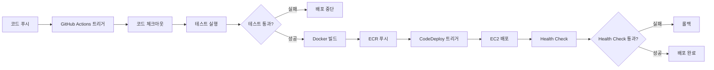

# CI/CD 가이드

## 개요

EchoShotX AI Worker 서비스는 GitHub Actions를 통한 CI/CD 파이프라인을 사용합니다. 코드 변경사항이 `main`/`master` 브랜치에 푸시되면 자동으로 테스트, 빌드, 배포가 실행됩니다.

## CI/CD 파이프라인 흐름



## GitHub Actions 워크플로우

### 워크플로우 파일 위치
`.github/workflows/deploy.yml`

### 주요 단계

1. **코드 체크아웃**
   - 소스 코드 다운로드
   - Git 정보 추출 (커밋 SHA, 브랜치 등)

2. **Python 환경 설정**
   - Python 3.10 설치
   - 의존성 캐싱

3. **테스트 실행**
   - `pytest` 실행
   - 테스트 커버리지 수집 (옵션)

4. **Docker 이미지 빌드**
   - Dockerfile을 사용한 이미지 빌드
   - 멀티 스테이지 빌드로 최적화

5. **ECR 푸시**
   - AWS ECR 로그인
   - 이미지 태깅 (latest, 커밋 SHA)
   - ECR에 푸시

6. **CodeDeploy 배포 트리거**
   - AWS CLI를 통한 배포 생성
   - 배포 상태 모니터링

## GitHub Secrets 설정

### 필수 Secrets

다음 Secrets를 GitHub 저장소에 설정해야 합니다:

1. **AWS_ACCESS_KEY_ID**
   - AWS 접근 키 ID
   - IAM 사용자 또는 역할의 접근 키

2. **AWS_SECRET_ACCESS_KEY**
   - AWS 시크릿 접근 키
   - IAM 사용자 또는 역할의 시크릿 키

3. **AWS_REGION**
   - AWS 리전
   - 예: `ap-northeast-2`

4. **ECR_REPOSITORY**
   - ECR 저장소 이름
   - 예: `echoshot-worker`

5. **CODE_DEPLOY_APPLICATION_NAME**
   - CodeDeploy 애플리케이션 이름
   - 예: `EchoShotWorker`

6. **CODE_DEPLOY_DEPLOYMENT_GROUP**
   - CodeDeploy 배포 그룹 이름
   - 예: `production`

### Secrets 설정 방법

1. GitHub 저장소로 이동
2. Settings → Secrets and variables → Actions
3. "New repository secret" 클릭
4. 이름과 값을 입력
5. "Add secret" 클릭

## IAM 권한 설정

### GitHub Actions용 IAM 사용자/역할

다음 권한이 필요합니다:

```json
{
  "Version": "2012-10-17",
  "Statement": [
    {
      "Effect": "Allow",
      "Action": [
        "ecr:GetAuthorizationToken",
        "ecr:BatchCheckLayerAvailability",
        "ecr:GetDownloadUrlForLayer",
        "ecr:BatchGetImage",
        "ecr:PutImage",
        "ecr:InitiateLayerUpload",
        "ecr:UploadLayerPart",
        "ecr:CompleteLayerUpload"
      ],
      "Resource": "*"
    },
    {
      "Effect": "Allow",
      "Action": [
        "codedeploy:CreateDeployment",
        "codedeploy:GetApplication",
        "codedeploy:GetApplicationRevision",
        "codedeploy:GetDeployment",
        "codedeploy:GetDeploymentConfig",
        "codedeploy:RegisterApplicationRevision"
      ],
      "Resource": "*"
    }
  ]
}
```

## 워크플로우 트리거

### 자동 트리거

#### Push to main/master
```yaml
on:
  push:
    branches:
      - main
      - master
```

#### Pull Request
```yaml
on:
  pull_request:
    branches:
      - main
      - master
```
- Pull Request는 테스트만 실행 (배포하지 않음)

### 수동 트리거

```yaml
on:
  workflow_dispatch:
    inputs:
      environment:
        description: 'Deployment environment'
        required: true
        default: 'production'
        type: choice
        options:
          - production
```

GitHub Actions UI에서 수동으로 워크플로우를 실행할 수 있습니다.

## 배포 환경

### 배포 설정

- **Production**: `main`/`master` 브랜치 푸시 시 자동 배포
- **Pull Request**: 테스트만 실행 (배포하지 않음)

### 환경 변수 주입

워크플로우에서 환경 변수를 설정할 수 있습니다:

```yaml
env:
  DOCKER_IMAGE_TAG: ${{ github.sha }}
  ECR_REPOSITORY: ${{ secrets.ECR_REPOSITORY }}
```

## Docker 이미지 태깅 전략

### 태그 형식

1. **latest**: 최신 배포
2. **{commit-sha}**: 커밋 SHA (예: `abc1234`)
3. **v{timestamp}**: 타임스탬프 (예: `v20240101120000`)

### 태깅 예시

```bash
# latest 태그
docker tag $IMAGE_NAME:latest $ECR_REPO:latest

# 커밋 SHA 태그
docker tag $IMAGE_NAME:latest $ECR_REPO:$GITHUB_SHA

# 타임스탬프 태그
docker tag $IMAGE_NAME:latest $ECR_REPO:v$(date +%Y%m%d%H%M%S)
```

## CodeDeploy 배포 트리거

### 배포 생성

```bash
aws deploy create-deployment \
  --application-name $CODE_DEPLOY_APPLICATION_NAME \
  --deployment-group-name $CODE_DEPLOY_DEPLOYMENT_GROUP \
  --s3-location bucket=$S3_BUCKET,key=$S3_KEY,bundleType=zip
```

### 배포 상태 확인

```bash
aws deploy get-deployment \
  --deployment-id $DEPLOYMENT_ID
```

## 롤백 전략

### 자동 롤백

1. **Health Check 실패 시**
   - CodeDeploy가 자동으로 이전 버전으로 롤백
   - Health check 스크립트에서 실패 반환

2. **배포 실패 시**
   - GitHub Actions에서 배포 실패 감지
   - 이전 Docker 이미지 태그로 재배포

### 수동 롤백

1. **CodeDeploy 콘솔**
   - 배포 이력에서 이전 배포 선택
   - "Rollback" 클릭

2. **GitHub Actions**
   - 이전 커밋으로 되돌리기
   - 자동 배포 트리거

## 모니터링 및 알림

### GitHub Actions 알림

- 워크플로우 실행 상태를 GitHub에서 확인
- 실패 시 이메일 알림 (설정 시)

### CodeDeploy 알림

- SNS를 통한 배포 상태 알림
- CloudWatch 알람 설정

## 문제 해결

### 워크플로우 실패

1. **로그 확인**
   - GitHub Actions 탭에서 로그 확인
   - 각 단계별 로그 확인

2. **권한 확인**
   - AWS 인증 정보 확인
   - IAM 권한 확인

3. **네트워크 문제**
   - ECR 접근 확인
   - 인터넷 연결 확인

### 배포 실패

자세한 내용은 [troubleshooting.md](./troubleshooting.md) 참조

## 최적화 팁

### 1. 캐싱 활용

- Docker 레이어 캐싱
- Python 의존성 캐싱
- 빌드 아티팩트 캐싱

### 2. 병렬 실행

- 테스트와 빌드를 병렬로 실행
- 여러 환경에 동시 배포 (옵션)

### 3. 조건부 실행

- 변경된 파일에 따라 테스트/빌드 스킵
- 특정 경로 변경 시에만 배포

## 보안 고려사항

### Secrets 관리

- Secrets는 절대 코드에 하드코딩하지 않음
- 민감한 정보는 GitHub Secrets 사용
- Secrets는 암호화되어 저장됨

### IAM 최소 권한

- 필요한 권한만 부여
- 정기적으로 권한 검토
- 불필요한 권한 제거

### 이미지 보안

- 보안 스캔 수행 (옵션)
- 취약점 스캔 도구 사용
- 최신 베이스 이미지 사용

## 참고 자료

- [GitHub Actions 문서](https://docs.github.com/en/actions)
- [AWS CodeDeploy 문서](https://docs.aws.amazon.com/codedeploy/)
- [ECR 문서](https://docs.aws.amazon.com/ecr/)

