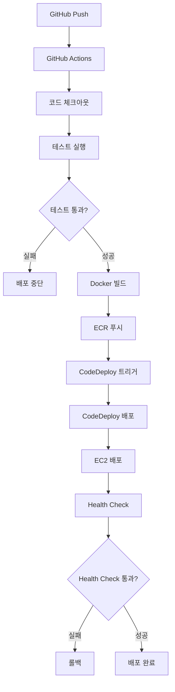

# 배포 아키텍처 상세

## 전체 시스템 아키텍처

```
┌──────────────┐
│ Mobile App   │
│  (Client)    │
└──────┬───────┘
       │ 1. 영상 업로드 + 작업 요청
       ↓
┌─────────────────────────────────────────────────────────────┐
│                    EC2-B (Spring + Redis)                   │
│  ┌──────────────┐         ┌──────────────┐                 │
│  │    Spring    │────────>│     SQS      │                 │
│  │   REST API   │ 2. 메시지│  작업 큐      │                 │
│  └──────────────┘  발행    └──────────────┘                 │
│         ↑                         │                         │
│         │ 7. 완료 콜백              │                         │
│         │                         │                         │
│  ┌──────────────┐                 │                         │
│  │    Redis     │                 │                         │
│  │   Pub/Sub    │<────────────────┼─────────────┐          │
│  └──────┬───────┘  5. 진행률      │              │          │
│         │          Publish        │              │          │
│         │ 6. Subscribe            │              │          │
│         ↓                         ↓              │          │
│  ┌──────────────┐          ┌─────────────┐      │          │
│  │ Redis        │          │  SQS Poll   │      │          │
│  │ Subscriber   │          │             │      │          │
│  │ (Spring)     │          └─────────────┘      │          │
│  └──────┬───────┘                               │          │
│         │                                        │          │
│         │ WebSocket                              │          │
│         ↓                                        │          │
│  ┌──────────────┐                               │          │
│  │   WebSocket  │                               │          │
│  │   Handler    │                               │          │
│  └──────────────┘                               │          │
└─────────┬──────────────────────────────────────────────────┘
          │ 8. FCM Push                            │
          ↓                                        │
   ┌──────────────┐                       ┌───────┴─────────┐
   │  Mobile App  │                       │   EC2-A         │
   │   (알림)     │                       │ Python Worker   │
   └──────────────┘                       │                 │
                                          │ 3. SQS 메시지   │
                                          │    소비         │
                                          │ 4. 영상 처리    │
                                          │ 5. Redis Pub ───┘
                                          │ 7. HTTP 콜백    │
                                          └─────────────────┘
```

## 배포 파이프라인 아키텍처

### CI/CD 흐름



## 컴포넌트 상세

### 1. GitHub Actions (CI)

**역할**: 코드 빌드, 테스트, Docker 이미지 생성 및 ECR 푸시

**주요 단계**:
1. 코드 체크아웃
2. Python 환경 설정
3. 의존성 설치
4. 테스트 실행 (pytest)
5. Docker 이미지 빌드
6. ECR 로그인
7. 이미지 태깅 및 푸시
8. CodeDeploy 배포 트리거

**트리거 조건**:
- `push` to `main`/`master`: 자동 배포
- `pull_request`: 테스트만 실행
- `workflow_dispatch`: 수동 배포

### 2. AWS ECR (Elastic Container Registry)

**역할**: Docker 이미지 저장 및 관리

**이미지 태깅 전략**:
- `latest`: 최신 배포
- `v{timestamp}`: 타임스탬프 기반 버전
- `{commit-sha}`: 커밋 SHA 기반 버전

### 3. AWS CodeDeploy

**역할**: EC2 인스턴스에 애플리케이션 배포 오케스트레이션

**배포 그룹**:
- EC2 인스턴스 태그 기반 선택
- Auto Scaling 그룹 지원 (향후 확장)

**라이프사이클 훅**:
- `BeforeInstall`: 사전 설치 스크립트
- `Install`: 설치 스크립트
- `AfterInstall`: 사후 설치 스크립트
- `ApplicationStart`: 애플리케이션 시작
- `ApplicationStop`: 애플리케이션 중지
- `ValidateService`: 서비스 검증

### 4. EC2-A (Python Worker)

**인스턴스 사양**:
- 인스턴스 타입: GPU 인스턴스 권장 (g4dn.xlarge 이상)
- OS: Amazon Linux 2 또는 Ubuntu 22.04
- Docker: 최신 버전 설치

**설치된 소프트웨어**:
- Docker & Docker Compose
- CodeDeploy Agent
- CloudWatch Agent (옵션)

**네트워크 설정**:
- 보안 그룹: SQS, S3, Redis 접근 허용
- VPC: 프라이빗 서브넷 권장

### 5. Docker 컨테이너

**기본 이미지**: `python:3.10-slim`

**설치된 패키지**:
- Python 3.10
- PyTorch (CUDA 지원)
- OpenCV
- FFmpeg
- Python 의존성 (requirements.txt)

**실행 환경**:
- 작업 디렉토리: `/app`
- 임시 디렉토리: `/tmp/video_processing`
- 모델 가중치: `/app/weights`

**환경 변수**:
- AWS 설정
- Spring API 설정
- Worker 설정
- Redis 설정

### 6. 애플리케이션 컴포넌트

#### SQS Client
- SQS 큐에서 작업 메시지 수신
- Long polling (WaitTimeSeconds: 20)
- 메시지 가시성 타임아웃 관리
- 처리 완료 후 메시지 삭제

#### Worker Pool
- 멀티프로세싱 기반 워커 풀
- 동시 작업 처리 (기본 4개)
- Graceful shutdown 지원

#### Job Processor
- 작업 처리 오케스트레이션
- S3 파일 다운로드/업로드
- 태스크 실행
- Spring API 콜백

#### Redis Client (구현 필요)
- 진행률 Pub/Sub
- 채널: `job:{job_id}:progress`
- 메시지 형식: `{"job_id": "...", "progress": 0-100, "status": "..."}`

## 데이터 흐름

### 작업 처리 흐름

1. **작업 수신**
   - SQS에서 메시지 수신
   - Job 객체로 변환
   - Worker Pool에 할당

2. **영상 다운로드**
   - S3에서 입력 영상 다운로드
   - 임시 디렉토리에 저장

3. **영상 처리**
   - 업스케일링 작업 실행
   - 진행률을 Redis에 Publish
   - 처리 완료 후 결과 파일 생성

4. **결과 업로드**
   - 처리된 영상을 S3에 업로드
   - S3 키 반환

5. **콜백 전송**
   - Spring API에 HTTP 콜백
   - 작업 결과 전송

6. **정리**
   - 임시 파일 삭제
   - SQS 메시지 삭제

## 확장성 고려사항

### 수평 확장
- 여러 EC2 인스턴스에 배포
- Auto Scaling 그룹 활용
- SQS를 통한 작업 분산

### 수직 확장
- 더 큰 인스턴스 타입 사용
- GPU 인스턴스 활용
- 워커 수 증가

### 모니터링
- CloudWatch 메트릭 수집
- SQS 큐 깊이 모니터링
- 작업 처리 시간 추적

## 보안 아키텍처

### 네트워크 보안
- VPC 내부 통신
- 보안 그룹 최소 권한
- NAT Gateway를 통한 인터넷 접근

### 인증 및 권한
- IAM 역할 기반 인증
- EC2 Instance Profile
- 최소 권한 원칙

### 데이터 보안
- S3 버킷 암호화
- 전송 중 암호화 (HTTPS)
- 민감 정보는 환경 변수로 관리

## 장애 대응

### 자동 복구
- Health check 실패 시 자동 재시작
- SQS 메시지 가시성 타임아웃으로 재처리

### 모니터링 및 알림
- CloudWatch 알람 설정
- SNS를 통한 알림 전송

### 롤백 절차
- CodeDeploy 롤백
- 이전 Docker 이미지 사용
- 데이터 손실 방지

